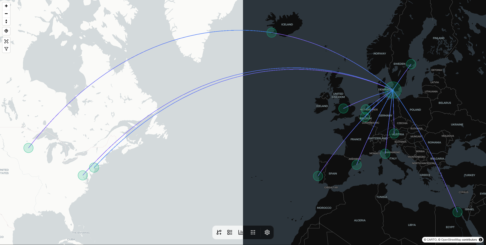

   
  
  
  
   
   

  

<h3 align="center">AirTrail</h3>

  

    A web application that allows users to track their flights and view their flight history.
  

## ✨ Features

- **World Map**: View all your flights on an interactive world map.
- **Flight History**: Keep track of all your flights in one place.
- **Statistics**: Get insights into your flight history with statistics.
- **Multiple Users**: Manage multiple users, share flights among them, secure your data with user authentication and
  integrate with your OAuth provider.
- **Responsive Design**: Use the application on any device with a responsive design.
- **Dark Mode**: Switch between light and dark mode.
- **Import Flights**: Import flights from various sources including MyFlightRadar24, App in the Air and JetLog.

## 🚀 Getting Started

- [Documentation](https://airtrail.johan.ohly.dk/docs/overview/introduction)
- [Installation](https://airtrail.johan.ohly.dk/docs/overview/quick-start)
- [About](https://airtrail.johan.ohly.dk/docs/overview/introduction)

## 🤝 Contributing

Want to contribute to AirTrail? Awesome! Check out the [contributing documentation](CONTRIBUTING.md) to get started.

If you find an issue, please report it on the [issue tracker](https://github.com/johanohly/AirTrail/issues/new/choose).

## Build Status

#### Sonarcloud Quality metrics

#### FOSSA license and security scans

#### OpenSSF best practices

## Star History

<a href="https://star-history.com/#johanohly/AirTrail&Date">
 <picture>
   <source media="(prefers-color-scheme: dark)" srcset="https://api.star-history.com/svg?repos=johanohly/AirTrail&type=Date&theme=dark" />
   <source media="(prefers-color-scheme: light)" srcset="https://api.star-history.com/svg?repos=johanohly/AirTrail&type=Date" />
   
 </picture>
</a>

## Acknowledgements

### Data Sources

> [Airport Data](https://github.com/komed3/airportmap-database)

> [Country Flags](https://flagpedia.net)

### Logo

The logo is from Lucide, which is a free icon pack that can be found [here](https://www.lucide.dev/).

> Copyright (c) for portions of Lucide are held by Cole Bemis 2013-2022 as part of Feather (MIT). All other copyright (
> c) for Lucide are held by Lucide Contributors 2022.
