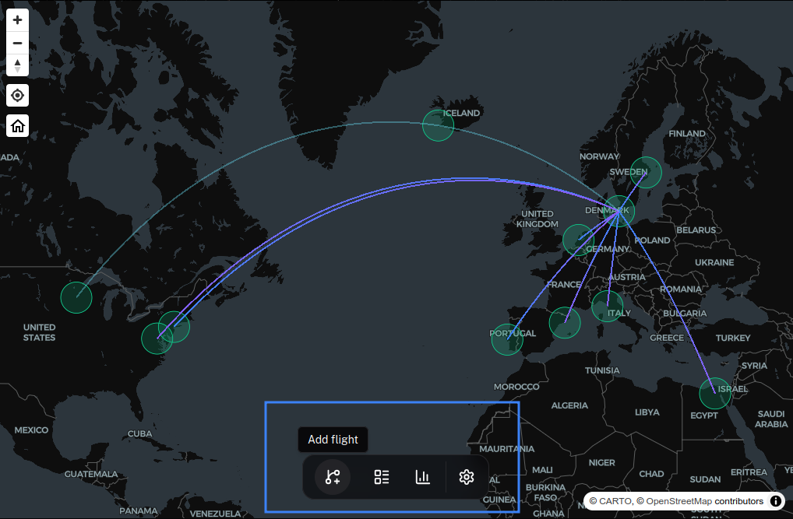

The main purpose of this application is to log flights.
To add one, click **Add flight**, the first button in the bottom navigation bar. The button is shown to users whose role includes the `flight.create.own` permission.

Fill in the form and click **Add flight** to save. Only the origin, destination, and departure date are required.

## From flight number

If you have a flight number, enter it in **Flight Number** at the top and click **Search**.
AirTrail looks up the flight and fills in what the provider returns, such as the origin, destination, airline, aircraft, registration, times, terminals, and gates.

- If several flights match, pick yours under **Select your flight**.
- Empty fields are filled in automatically. If a field already has a different value, the **Resolve data conflicts** dialog lets you choose between the **Current** and the **Fetched** value for each field.

### Flight Data Providers

By default, AirTrail uses **adsbdb** for flight number lookups. While adsbdb is free and doesn't require configuration, it has some limitations:

- Limited flight data coverage
- No ability to search flights by date
- Less reliable data for some routes and airlines

For much better results and additional features, you can configure **AeroDataBox** as your flight lookup provider instead. AeroDataBox offers:

- More comprehensive flight data
- Better accuracy and coverage
- **Ability to search by date**

With AeroDataBox, the departure date, origin, and destination are taken into account if you set them before searching.

To set up AeroDataBox, see the [AeroDataBox integration documentation](/docs/integrations/aerodatabox).

## Origin and Destination

The **From** and **To** fields are required.
Start typing the name of the airport and select the correct one from the list.
For the most consistent results, search using the ICAO or IATA code.

## Date and Time

<Callout title="Timezones">
  By default, times are entered in the local timezone of each airport. So if
  you are flying from New York to London, the departure time should be entered
  in Eastern Time and the arrival time in Greenwich Mean Time. To enter times
  in UTC or your device's timezone instead, click the settings icon next to
  **Time** and change **Flight times**. This preference also applies to the
  rest of AirTrail and can be changed under **Settings > Preferences**.
</Callout>

The departure date is required, the rest are optional.

- If an arrival time is entered without an arrival date, the arrival date is assumed to be the same as the departure date.
- An arrival date needs an arrival time.
- The arrival must be after the departure.
- A warning is shown if the flight takes more than 24 hours.

If you don't enter both departure and arrival times, AirTrail estimates the flight duration from the distance between the airports.

### Partial dates

If you only know the year or month of a flight, click the calendar icon next to **Departure** (**Use partial date**). Enter the **Year** and, optionally, the **Month**. Switching to a partial date clears the arrival date, the times, and the detailed timetable.

Click **Use full departure/arrival datetimes** to switch back.

### Detailed timetable

Click **Add detailed timetable (taxi, takeoff, landing times...)** to enter **Scheduled** and **Actual** times for **Gate departure**, **Takeoff**, **Landing**, and **Gate arrival**. AirTrail shows the resulting taxi-out, air, taxi-in, and total times.

Click **Use simple departure/arrival inputs** to return to the simple fields.

## Flight details

- **Aircraft**: The aircraft type.
- **Registration**: The aircraft registration (tail number).
- **Airline**: The operating airline.
- **Notes**: Free-text notes about the flight.

## Passengers

The **Passenger Details** section starts with you as the first passenger. Click **Add Passenger** to add more. Each passenger is either a user on the instance or a guest: to add a guest, type their name and choose **Use "name" as guest**.

For each passenger you can set:

- **Class**: Economy, Economy+, Business, First, or Private.
- **Reason**: Leisure, Business, Crew, or Other.
- **Seat**: The seat number and seat type.

At least one passenger must be a user.

## More options

The buttons at the bottom left of the form open extra fields. On larger screens they show only an icon; on small screens they also show a label.

- **Terminal & Gate** (arrow icon): The departure and arrival terminal and gate.
- **Flight Track** (route icon): Attach the actual flown path from a file. See [Flight Tracks](/docs/features/flight-tracks).
- **Custom Fields** (sliders icon): The flight's [custom fields](/docs/features/custom-fields).
