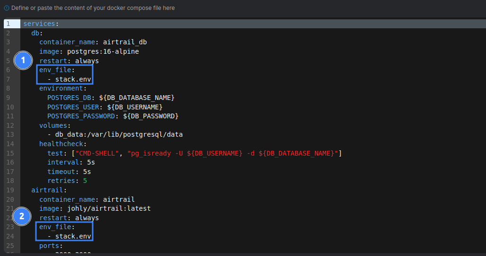

Portainer is a lightweight management UI which allows you to easily manage your Docker instances.

To install Portainer, you can follow the [Official documentation](https://docs.portainer.io/start/install-ce/server/docker).

## Create a stack

  

    Head over to the **Stacks** section in the Portainer UI and click on **Add stack**.
  

  

    Fill in the following details:

    - **Name**: Give your stack a name, for example `AirTrail`.
    - **Web editor**: Copy and paste the content from the [docker-compose.yml](https://raw.githubusercontent.com/JohanOhly/AirTrail/main/docker/production/compose.yml) file.
      - Replace all instances of `.env` with `stack.env`
        
    - **Environment variables**: Go into "Advanced mode" and copy-paste the contents of [.env](https://raw.githubusercontent.com/JohanOhly/AirTrail/main/.env.example) into the text area.
      - Change the `ORIGIN` to the URL that you will be accessing your AirTrail instance from. Or use `ORIGINS` for passing multiple URLs in a comma-separated list.
      - Change the `DB_PASSWORD` to a secure password. Optionally, change other database settings.

  

  

    Click **Deploy the stack**.
    <Callout>
      After deploying the stack, you should follow the [Post Installation](/docs/install/post-installation) steps.
    </Callout>
  

