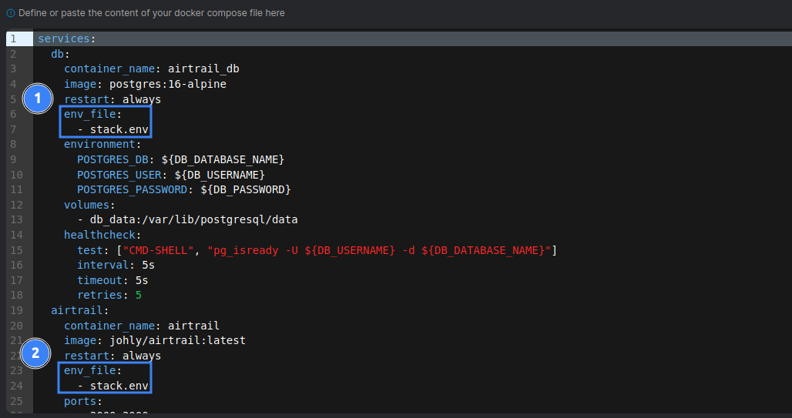

[Portainer](https://docs.portainer.io/start/install-ce/server/docker) is a web interface for managing Docker. AirTrail runs in Portainer as a stack built from the standard Compose file.

  

    In Portainer, open **Stacks** and click **Add stack**. Name it, for example, `airtrail`.
  

  

    In the **Web editor**, paste the contents of [compose.yml](https://raw.githubusercontent.com/JohanOhly/AirTrail/main/docker/production/compose.yml).
    Replace both `.env` references under `env_file` with `stack.env`, which is how Portainer passes stack variables to containers:

    

  

  

    Under **Environment variables**, switch to **Advanced mode** and paste the contents of [.env.example](https://raw.githubusercontent.com/JohanOhly/AirTrail/main/.env.example). Then:

    - Set `ORIGIN` to the exact URL you will open AirTrail at.
    - Change `DB_PASSWORD` and the password inside `DB_URL` to the same random value (letters and digits only).
    - Behind a reverse proxy, add `ADDRESS_HEADER=X-Forwarded-For`.

  

  

    Click **Deploy the stack**, then follow the [post-installation](/docs/install/post-installation) steps.
  

## Uploads

The stack creates a named `uploads` volume that is already writable by the app. If you switch it to a bind mount on the host, the folder must be owned by UID and GID `1000`. See [Uploads and file permissions](/docs/install/docker-compose#uploads-and-file-permissions).

## Updating

Open the stack, click **Editor**, then **Update the stack** with **Re-pull image and redeploy** enabled. Take a [backup](/docs/administration/backup) first.
